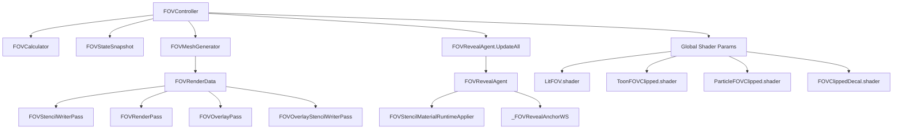

# Project VOID FOV System Documentation

> 현재 문서는 **지금 저장소의 실제 구현 상태**를 기준으로 정리한 FOV(시야 제한) 시스템 문서입니다.  
> 이 문서의 목적은 다음 네 가지입니다.
>
> 1. 지금 FOV 시스템이 **어떻게 동작하는지** 빠르게 이해할 수 있게 한다.
> 2. 새 오브젝트/셰이더/이펙트를 추가할 때 **어디를 맞춰야 하는지** 알려준다.
> 3. 과거에 발생했던 **실루엣 누수(silhouette leak)** 같은 렌더링 버그의 원인과 해결 방식을 기록한다.
> 4. 이후 구조 변경 시 **무엇을 건드리면 위험한지** 명확히 남긴다.

---

## 1. 시스템 목표

이 FOV 시스템은 탑다운/사선 시점 게임플레이에서 다음을 동시에 만족시키도록 설계되어 있습니다.

- 로컬 플레이어 기준으로만 시야를 계산한다.
- 무기/조준 상태에 따라 시야 모양이 바뀐다.
  - 원형(360도)
  - 부채꼴
  - 복합(조준 중 주변 시야 유지)
- 장애물(벽)에 가려진 영역은 보이지 않아야 한다.
- 시야 밖 화면은 어두워져야 한다.
- 플레이어/몹/아이템/투사체/이펙트 등 reveal 대상은 시야 안에서만 보여야 한다.
- 모바일에서도 감당 가능한 성능을 유지해야 한다.

---

## 2. 전체 구조 한눈에 보기

핵심 요약:

- **도메인 계산**은 `FOVController`가 담당
- **시각 메시/스텐실/오버레이 렌더링**은 URP Render Feature가 담당
- **오브젝트별 reveal 참여 선언**은 `FOVRevealAgent`가 담당
- **오브젝트 셰이더 실제 clip/dim**은 FOV 대응 셰이더가 담당

---

## 3. 핵심 구성 요소

## 3.1 런타임 계산 계층

### `Assets/Scripts/FOV/FOVController.cs`
FOV 시스템의 메인 컨트롤러입니다.

주요 책임:

- 로컬 플레이어인지 판단
- 현재 무기/조준 상태에 따라 시야 범위와 각도 결정
- 매 프레임 FOV 계산 트리거
- 계산 결과를 `FOVStateSnapshot`에 저장
- FOV 메시 갱신
- 전역 셰이더 파라미터 갱신
- 모든 `FOVRevealAgent` anchor 갱신 요청

중요 필드:

- `_baseViewRange`
- `_rayCount`
- `_enableSoftEdge`
- `_edgeSoftness`
- `_falloffExp`
- `_fovHeight`
- `_revealStencilHeight`
- `_obstacleSampleHeight`
- `_localPlayerViewRange`

특히 주의할 값:

- `_fovHeight`
  - **시각용 FOV 메시가 그려지는 높이**
- `_revealStencilHeight`
  - **reveal stencil plane의 공통 높이**
  - 특정 몹 전용 값이 아니라, **모든 reveal 대상에 공통 적용되는 기준 높이**
- `_obstacleSampleHeight`
  - 시야 차폐 raycast가 실제로 시작되는 높이

---

### `Assets/Scripts/FOV/FOVCalculator.cs`
레이캐스트로 각 방향의 실제 보이는 거리(hit distance)를 계산합니다.

지원 형태:

- `CalculateCircularFOV`
- `CalculateFanFOV`
- `CalculateCompositeFOV`

출력은 각 ray 방향별 distance 배열이며, 이 값이:

- FOV 메시 생성
- 오브젝트 경계 dim 계산
- 오브젝트 가시성 질의

의 공통 기준이 됩니다.

---

### `Assets/Scripts/FOV/FOVStateSnapshot.cs`
현재 프레임의 FOV 상태를 담는 읽기 중심 컨테이너입니다.

포함 데이터:

- Origin
- Forward
- CurrentRange
- CurrentAngle
- StartAngle / EndAngle
- HitDistanceCount
- hit distance 배열

이 스냅샷은 렌더링과 질의가 같은 데이터를 공유하도록 만드는 핵심 포인트입니다.

---

### `Assets/Scripts/FOV/FOVVisibilityQuery.cs`
FOV snapshot을 기준으로 월드 좌표 또는 콜라이더가 시야 안에 들어오는지 판단하는 유틸리티입니다.

현재는 주로:

- `TryGetBoundaryMetrics`
- `IsInside`
- `IsColliderInside`

를 제공합니다.

현재 최종 상태에서는 몹 hard hide를 제거했기 때문에, 이 유틸은 **시스템 보조 질의 도구**로 남아 있습니다.
향후 게임플레이 레벨의 가시성 로직이 필요하면 다시 재사용할 수 있습니다.

---

## 3.2 메시 생성 / 프레임 공유 계층

### `Assets/Scripts/FOV/FOVMeshGenerator.cs`
FOV hit distance 배열을 실제 렌더 가능한 메시로 변환합니다.

메시 구조:

- 중심점 1개
- 내부 링 1개
- 외부 링 1개

즉, 단일 폴리곤이 아니라:

- 내부 채움
- 외곽 soft edge

를 모두 표현할 수 있는 구조입니다.

두 개의 matrix를 함께 생성합니다:

- `visualMatrix`
  - FOV 시각 메시용
- `revealStencilMatrix`
  - 오브젝트 reveal stencil용

이 둘은 같은 메시를 공유하지만, **다른 높이**에 그릴 수 있습니다.

---

### `Assets/Scripts/Rendering/FOVRenderData.cs`
현재 프레임의 FOV 메시와 matrix를 render pass들 사이에 공유하는 정적 저장소입니다.

보관 값:

- `FOVMesh`
- `FOVVisualMatrix`
- `FOVRevealStencilMatrix`
- `HasFOVMeshData`

---

## 3.3 Reveal 선언 계층

### `Assets/Scripts/FOV/FOVRevealAgent.cs`
게임플레이 오브젝트가 “FOV reveal에 참여한다”는 사실을 선언하는 런타임 에이전트입니다.

현재 역할:

- reveal policy 보관
- 계층 전체 renderer 탐색
- `FOVStencilMaterialRuntimeApplier` 호출
- `_FOVRevealAnchorWS`를 각 renderer의 `MaterialPropertyBlock`으로 전달

즉, 이 컴포넌트는 지금 구조에서:

- “이 오브젝트는 FOV 대상이다”
- “이 오브젝트의 reveal 기준점(anchor)은 여기다”

를 셰이더와 렌더 파이프라인 쪽에 알려주는 연결점입니다.

---

### `Assets/Scripts/FOV/FOVRevealMode.cs`
현재는 다음 정책을 갖습니다.

- `None`
- `StencilOnly`

이름상 확장 여지가 있지만, 현재 실제 구현은 **StencilOnly 중심**입니다.

---

### `Assets/Scripts/FOV/FOVStencilMaterialRuntimeApplier.cs`
FOV 대응 셰이더를 사용하는 머티리얼을 런타임 reveal용 머티리얼로 바꿔주는 유틸입니다.

동작 방식:

- hierarchy 내 renderer를 찾음
- material에 `_GlobalStencilComp` 프로퍼티가 있으면 대상
- reveal용 복제 material을 캐싱 생성
- `_GlobalStencilComp = Equal(3f)` 설정

중요한 제한:

> `_GlobalStencilComp` 프로퍼티가 **없는 머티리얼은 이 유틸이 건드리지 않습니다.**

즉,

- FOV 대응 셰이더 기반 머티리얼만 자동 reveal 대상이 되며
- 일반 외부 에셋 머티리얼은 자동으로 FOV 시스템에 들어오지 않습니다.

이게 향후 새 오브젝트 추가 시 가장 중요한 체크포인트입니다.

---

## 3.4 URP 렌더 계층

### `Assets/Scripts/Rendering/FOVRendererFeature.cs`
URP Renderer Feature 진입점입니다.

현재 구성 패스:

- `FOVStencilWriterPass`
- `FOVRenderPass`
- `FOVOverlayStencilWriterPass`
- `FOVOverlayPass`
- `FOVStencilClipPass` (설정 시)

현재 중요한 상태:

- `FOVStencilWriterPass`는 **`BeforeRenderingPrePasses`** 에서 실행됩니다.
  - 이게 최근 실루엣 버그 해결의 핵심 변경점입니다.

---

### `Assets/Scripts/Rendering/FOVStencilWriterPass.cs`
FOV reveal stencil을 depth/stencil에 먼저 기록하는 패스입니다.

현재는:

- **depth target만 configure**
- color를 직접 쓰지 않음

즉 목적은 순수하게:

- “이 프레임 reveal 영역은 어디인가”

를 prepass 전에 depth/stencil에 박는 것입니다.

---

### `Assets/Scripts/Rendering/FOVRenderPass.cs`
실제 FOV 시각 메시를 그립니다.

이 패스는:

- soft edge 시각화
- dim 연결

같은 시각적 역할을 담당합니다.

---

### `Assets/Scripts/Rendering/FOVOverlayPass.cs`
FOV 바깥 영역을 어둡게 덮는 fullscreen overlay 패스입니다.

즉:

- “밖은 어둡다”

를 만드는 최종 화면 효과가 여기입니다.

---

### `Assets/Scripts/Rendering/FOVStencilClipPass.cs`
특정 레이어를 stencil 값에 따라 별도로 렌더링하는 패스입니다.

하지만 현재 renderer asset 설정에서는:

- `stencilClipLayers`가 0

이라서 **사실상 비활성 상태**입니다.

즉 지금 프로젝트의 핵심 reveal은:

- 별도 layer clip pass

가 아니라

- **개별 FOV 대응 셰이더**

를 통해 이루어집니다.

---

## 4. 현재 실제 렌더 순서

개념상 현재 메인 카메라 렌더 흐름은 아래 순서로 이해하면 됩니다.

1. **FOVStencilWriterPass**
   - reveal 영역을 stencil/depth에 먼저 기록
2. **Depth / DepthNormals prepass**
   - FOV 대응 셰이더는 이제 여기서도 stencil clip을 따름
3. 일반 opaque/transparent 렌더링
   - `LitFOV`, `ToonFOVClipped`, `ParticleFOVClipped`, `FOVClippedDecal`
4. `FOVRenderPass`
   - FOV 시각 메시 렌더
5. `FOVOverlayStencilWriterPass`
   - overlay가 비켜야 할 영역 기록
6. `FOVOverlayPass`
   - 바깥 영역 dim

---

## 5. 스텐실 계약(Stenciling Contract)

현재 시스템은 **bit 단위 역할 분리**를 합니다.

## 5.1 bit 0 : reveal mask

`Hidden/ProjectVOID/FOVStencilWriter`

- `Ref 1`
- `WriteMask 1`

즉 stencil bit 0에 reveal 영역을 기록합니다.

---

## 5.2 bit 1 : overlay mask

`Hidden/ProjectVOID/FOVOverlayStencilWriter`

- `Ref 2`
- `WriteMask 2`

즉 overlay가 비켜야 하는 FOV 내부 영역을 bit 1로 기록합니다.

---

## 5.3 reveal 대상 셰이더의 사용 방식

예: `LitFOV`, `ToonFOVClipped`, `ParticleFOVClipped`, `FOVClippedDecal`

실질 의미:

- `Ref 3`, `ReadMask 1`
  - mask 연산 후 bit 0 기준으로 reveal 판정
- `WriteMask 2`, `Pass Replace`
  - 통과한 픽셀은 bit 1 쪽에 overlay-safe 영역으로도 기록 가능

즉 숫자 `3` 자체보다 중요한 건:

- **bit 0을 읽어 reveal**
- **bit 1을 써서 overlay와 연계**

라는 계약입니다.

---

## 6. FOV 대응 셰이더별 역할

## 6.1 `Assets/Shaders/LitFOV.shader`
용도:

- 대부분의 lit 기반 일반 메시
- 몹, 아이템, 방어구, 일부 월드 오브젝트

중요 특징:

- `ForwardLit`에 FOV stencil 적용
- obstacle-aware boundary dim 계산
- `DepthOnly`, `DepthNormals`에도 stencil 적용됨

의미:

- 화면 렌더뿐 아니라 prepass 단계에서도 시야 밖 픽셀을 막음

---

## 6.2 `Assets/Shaders/ToonFOVClipped.shader`
용도:

- Toon 계열 메시
- outline이 필요한 캐릭터/오브젝트

중요 특징:

- `Outline` pass 있음
- `ForwardLit` pass 있음
- `DepthOnly`, `DepthNormals`에도 stencil 적용됨

주의:

- outline pass가 별도 패스이기 때문에, FOV 문제를 추적할 때 이 셰이더는 항상 의심 후보였습니다.
- 현재는 prepass 누수 수정 후 큰 문제는 줄었지만, outline 관련 연출 변경 시 재확인이 필요합니다.

---

## 6.3 `Assets/Shaders/ParticleFOVClipped.shader`
용도:

- drop effect 등 파티클 시스템

현재 상태:

- **URP 기본 `Particles/Unlit` 기반으로 재작성**
- SubShader 수준 stencil 적용
- forward + depth + depth normals + editor용 pass 전체가 같은 stencil 규칙을 따름

의미:

- 이전의 간이 커스텀 파티클 셰이더보다
- URP 파티클 머티리얼/인스턴싱과의 호환성이 높음

---

## 6.4 `Assets/Shaders/FOVClippedDecal.shader`
용도:

- FOV 안에서만 보여야 하는 decal 계열

특징:

- transparent 계열
- 단일 forward stencil clip 기반
- prepass 누수 타입 문제와는 성격이 다름

---

## 6.5 `Assets/Shaders/FOVMesh.shader`
용도:

- FOV 시각 메시 렌더링

역할:

- soft edge와 거리/측면 감쇠를 이용해
- 시야 경계의 어두운 연결감을 시각적으로 표현

---

## 6.6 `Assets/Shaders/FOVOverlay.shader`
용도:

- fullscreen dim overlay

역할:

- 시야 밖 전체를 어둡게 덮음
- bit 1 overlay mask를 읽어서 FOV 내부는 비켜감

---

## 7. 현재 reveal 대상 등록 방식

현재 reveal 대상으로 시스템에 들어오는 대표 오브젝트는 다음과 같습니다.

- 플레이어
- 몹
- 아이템
- 투사체

이들은 각자의 런타임 진입점에서:

- `FOVRevealAgent.Ensure(gameObject, FOVRevealMode.StencilOnly)`

를 호출해 reveal 대상임을 선언합니다.

즉 현재 구조는:

- **플레이어가 시야를 계산하고**
- **대상 오브젝트가 reveal에 참여를 선언하며**
- **셰이더가 실제 픽셀 clip/dim을 수행하는 방식**

입니다.

---

## 8. `revealStencilHeight`의 실제 의미

`revealStencilHeight`는 자주 오해되는 값입니다.

현재 올바른 의미는:

> **공통 reveal plane 높이**

입니다.

이 값은:

- 몹 전용
- 플레이어 전용
- 특정 오브젝트 전용

이 아니라,

**FOV stencil로 드러나야 하는 모든 오브젝트가 공통으로 참조하는 reveal plane 높이**

입니다.

왜 별도로 존재하나?

- 시각용 FOV 메시 높이와
- reveal 판정용 스텐실 높이를

다르게 가져가고 싶을 수 있기 때문입니다.

예:

- 바닥에 붙는 시각 표현은 낮게
- reveal stencil은 조금 더 높게

이런 식의 조절이 가능합니다.

단, 과거 실험에서 이 값을 `_fovHeight`와 같게 맞춰봤지만, 실루엣 버그의 근본 원인은 아니었습니다.

---

## 9. 최근 실루엣 버그의 원인과 수정

## 9.1 증상

- 몹이 시야 밖인데
- 아주 희미한 실루엣처럼 남아 보임

특히 Frame Debugger 상에서:

- `DrawOpaqueObjects` 이전 단계에서도 이미 잔상이 보이는 현상이 확인되었습니다.

---

## 9.2 실제 원인

근본 원인은:

> **시야 밖 몹이 FOV stencil보다 먼저 `DepthOnly` / `DepthNormals` prepass에 참여하고 있었기 때문**

이렇게 되면:

- 시야 밖 몹이 depth / normal 버퍼에는 먼저 기록됨
- SSAO나 screen-space 계열 효과가 그 정보를 읽음
- 결과적으로 본체가 안 보여도 실루엣처럼 잔상이 남음

즉 문제는 단순히

- “몹을 로직으로 숨길지 말지”

가 아니라,

- **렌더 순서와 prepass clip 누수**

였습니다.

---

## 9.3 최종 수정

다음 세 가지를 적용했습니다.

1. `FOVStencilWriterPass`를 `BeforeRenderingPrePasses`로 이동
2. stencil writer가 depth target만 사용하도록 정리
3. `LitFOV` / `ToonFOVClipped`의
   - `DepthOnly`
   - `DepthNormals`
   패스에도 동일한 stencil 규칙 추가

결과:

- 시야 밖 몹이 prepass 버퍼에 먼저 새지 않음
- 실루엣 누수 해결
- 몹 hard hide 같은 임시 로직 제거 가능

---

## 9.4 왜 hard hide를 최종 제거했나

실루엣 버그를 임시로 가리기 위해 한때 `Renderer.forceRenderingOff` 기반 hard hide를 사용했지만,
그 방식은 다음 문제를 가집니다.

- 부분 가시성을 깨뜨림
- “일부만 보여야 하는 상황”을 표현하지 못함
- 근본 원인(prepass 누수)을 숨겨 버림

현재는 근본 원인을 막았기 때문에 hard hide는 제거되었습니다.

---

## 10. 모바일 성능 관점

현재 FOV 시스템은 모바일 기준으로도 비교적 현실적인 편입니다.

### 장점

- 로컬 플레이어만 FOV 계산
- ray count 고정 범위 내 제어
- dynamic mesh 재사용으로 GC 최소화
- mask texture / blur / SDF 없음
- stencil + 메시 + overlay 기반

### 비용 포인트

- 매 프레임 raycast
- FOV 메시 갱신
- 추가 render pass
- FOV 대응 셰이더의 stencil/depth pass

### 현재 판단

- soft mask / SDF 방식보다 훨씬 가볍고
- 지금 구조가 모바일에 더 적합합니다.

---

## 11. 새 오브젝트/셰이더 추가 시 체크리스트

새 reveal 대상 추가 시 아래를 반드시 확인하세요.

### 11.1 오브젝트가 reveal 대상인가?
- 시야 안에서만 보여야 하나?
- 시야 밖 dim/clip 영향을 받아야 하나?

그렇다면:
- `FOVRevealAgent`를 붙이거나 `Ensure(...)`를 호출해야 합니다.

---

### 11.2 머티리얼이 FOV 대응 셰이더인가?
다음 중 하나여야 안전합니다.

- `LitFOV`
- `ToonFOVClipped`
- `ParticleFOVClipped`
- `FOVClippedDecal`

그 외 셰이더면:
- `_GlobalStencilComp`가 없을 수 있고
- runtime applier 대상이 아닐 수 있으며
- 다시 누수될 수 있습니다.

---

### 11.3 depth/depthnormals 패스가 있는가?
있다면 반드시 확인:

- 그 pass도 stencil 규칙을 따르는가?

이걸 놓치면 예전 실루엣 버그가 다시 생길 수 있습니다.

---

### 11.4 파티클은 반드시 파티클용 FOV 셰이더를 쓸 것
일반 메시용 셰이더를 파티클에 억지로 쓰면:

- GPU instancing
- URP 파티클 입력
- 머티리얼 프로퍼티 호환

문제가 생길 수 있습니다.

따라서 파티클은 `ParticleFOVClipped.shader`를 사용합니다.

---

## 12. 디버깅 가이드

## 12.1 시야 밖 오브젝트가 보인다
먼저 확인:

1. reveal 대상에 `FOVRevealAgent`가 붙어 있는가?
2. 머티리얼이 FOV 대응 셰이더인가?
3. 해당 셰이더의 `DepthOnly`, `DepthNormals`가 stencil을 따르는가?
4. Frame Debugger에서 어느 패스에서 먼저 보이는가?

---

## 12.2 Frame Debugger에서 볼 것

우선순위:

1. `FOV Stencil Writer`
2. `DrawDepthNormalPrepass`
3. `DrawOpaqueObjects`
4. `DrawTransparentObjects`
5. `FOV Overlay`

특히:

- `DrawOpaqueObjects` 이전부터 잔상이 보이면
- prepass/SSAO 누수를 의심합니다.

---

## 12.3 새 외부 에셋이 누수된다
대부분 원인은:

- FOV 셰이더 미사용
- `_GlobalStencilComp` 없음
- 파티클에 잘못된 셰이더 사용

입니다.

---

## 13. 현재 시스템의 한계

현재 구조는 안정적이지만 완전한 최종형은 아닙니다.

한계:

- reveal 대상이 여전히 **FOV 대응 셰이더**에 의존함
- 새 외부 머티리얼 추가 시 수동 확인이 필요함
- FOVStencilClipPass 기반 layer reveal은 현재 비활성 상태라
  대부분의 reveal은 개별 셰이더 계약에 의존함

즉 지금은:

- **유연성과 성능의 균형**

을 택한 구조입니다.

---

## 14. 유지보수 규칙

앞으로 이 시스템을 만질 때는 아래 규칙을 지키는 것이 좋습니다.

1. `FOVStencilWriterPass`의 타이밍을 prepass 뒤로 되돌리지 말 것
2. FOV 대응 셰이더에서 `DepthOnly` / `DepthNormals`의 stencil 규칙을 제거하지 말 것
3. reveal 대상에 일반 셰이더를 무심코 넣지 말 것
4. 파티클은 파티클 전용 FOV 셰이더를 사용할 것
5. hard hide는 **버그 은폐용 임시책**으로만 사용하고, 기본 구조로 되돌리지 말 것

---

## 15. 빠른 요약

현재 Project VOID의 FOV 시스템은:

- `FOVController`가 로컬 플레이어 기준 시야를 계산하고
- `FOVMeshGenerator`가 메시를 만들고
- URP Render Feature가 stencil / visual mesh / overlay를 처리하고
- `FOVRevealAgent`가 대상 오브젝트를 reveal 시스템에 연결하며
- `LitFOV`, `ToonFOVClipped`, `ParticleFOVClipped`, `FOVClippedDecal`이 실제 픽셀 단위 clip/dim을 수행하는 구조입니다.

최근 해결된 가장 중요한 버그는:

> **시야 밖 오브젝트가 prepass(Depth/DepthNormals)에 먼저 새서 실루엣처럼 남는 문제**

였고, 현재는:

- stencil writer 선행
- prepass stencil 적용

으로 해결된 상태입니다.

---

## 16. 관련 파일 목록

### 계산 / 상태
- `Assets/Scripts/FOV/FOVController.cs`
- `Assets/Scripts/FOV/FOVCalculator.cs`
- `Assets/Scripts/FOV/FOVMeshGenerator.cs`
- `Assets/Scripts/FOV/FOVStateSnapshot.cs`
- `Assets/Scripts/FOV/FOVVisibilityQuery.cs`

### reveal 연결
- `Assets/Scripts/FOV/FOVRevealAgent.cs`
- `Assets/Scripts/FOV/FOVRevealMode.cs`
- `Assets/Scripts/FOV/FOVStencilMaterialRuntimeApplier.cs`

### 렌더 패스
- `Assets/Scripts/Rendering/FOVRendererFeature.cs`
- `Assets/Scripts/Rendering/FOVStencilWriterPass.cs`
- `Assets/Scripts/Rendering/FOVRenderPass.cs`
- `Assets/Scripts/Rendering/FOVOverlayPass.cs`
- `Assets/Scripts/Rendering/FOVStencilClipPass.cs`
- `Assets/Scripts/Rendering/FOVRenderData.cs`

### 셰이더
- `Assets/Shaders/FOVStencilWriter.shader`
- `Assets/Shaders/FOVOverlayStencilWriter.shader`
- `Assets/Shaders/FOVMesh.shader`
- `Assets/Shaders/FOVOverlay.shader`
- `Assets/Shaders/LitFOV.shader`
- `Assets/Shaders/ToonFOVClipped.shader`
- `Assets/Shaders/ParticleFOVClipped.shader`
- `Assets/Shaders/FOVClippedDecal.shader`

