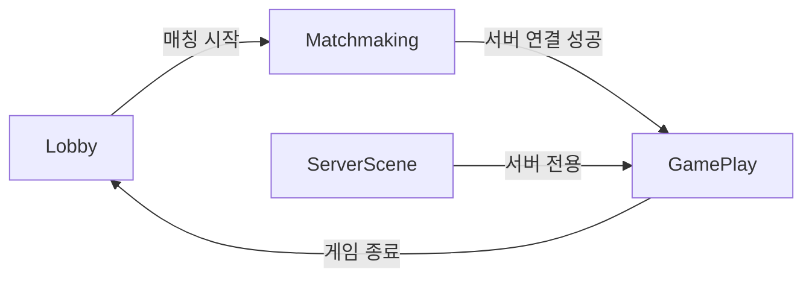

# FishNet 4.6.18R Pro Unity 설정 가이드

> **버전**: FishNet 4.6.18R Pro  
> **대상 프로젝트**: Project-VOID (Photon Fusion → FishNet 마이그레이션)

---

## 📋 목차

1. [프로젝트 씬 구조](#1-프로젝트-씬-구조)
2. [FishNet NetworkManager 설정](#2-fishnet-networkmanager-설정)
3. [씬별 설정 상세](#3-씬별-설정-상세)
4. [Manager 컴포넌트 설정](#4-manager-컴포넌트-설정)
5. [프리팹 설정](#5-프리팹-설정)
6. [Build Settings](#6-build-settings)
7. [테스트 방법](#7-테스트-방법)
8. [문제 해결](#8-문제-해결)

---

## 1. 프로젝트 씬 구조

### 1.1 씬 흐름



### 1.2 씬별 역할

| 씬 이름 | 파일명 | 역할 | 네트워크 |
|--------|-------|------|---------|
| **Lobby** | `Lobby.unity` | 메인 메뉴, 로그인, 게임모드 선택 | 오프라인 + FishNet Client |
| **Matchmaking** | `Matchmaking.unity` | 서버 검색, 연결 대기 UI | FishNet Client 연결 시도 |
| **GamePlay** | `GamePlay.unity` | 실제 게임 플레이 | FishNet 서버/클라이언트 |
| **ServerScene** | `ServerScene.unity` | 헤드리스 서버 전용 | FishNet Server Only |

### 1.3 씬 전환 흐름

```
[클라이언트 플로우]
Lobby → Matchmaking → (서버 연결) → GamePlay → (게임 종료) → Lobby

[서버 플로우]  
ServerScene → (플레이어 입장) → GamePlay 로드
```

---

## 2. FishNet NetworkManager 설정

### 2.1 NetworkManager 배치 전략

> ⚠️ **중요**: 서버 빌드와 클라이언트 빌드에서 **각각 다른 씬에 NetworkManager**가 필요합니다!

| 빌드 타입 | 시작 씬 | NetworkManager 위치 |
|---------|--------|-------------------|
| **서버 빌드** (Headless) | `ServerScene` | ServerScene에 배치 |
| **클라이언트 빌드** | `Lobby` | Lobby에 배치 |

### 2.2 서버용 NetworkManager (ServerScene)

```
ServerScene
└── NetworkManager (서버 전용)
    ├── NetworkManager (Script)
    │   └── Dont Destroy On Load: ☑
    ├── Tugboat (Transport)
    │   └── Port: 7777
    ├── ServerManager
    │   └── Start On Headless: ☑ ◀━━ 필수!
    ├── DefaultScene
    └── DefaultObjectPool
```

**ServerManager 설정**:
```
┌─────────────────────────────────────────────────────────┐
│ ServerManager (Script)                                   │
├─────────────────────────────────────────────────────────┤
│ ☑ Start On Headless  ◀━━ 헤드리스 빌드 시 자동 서버 시작│
└─────────────────────────────────────────────────────────┘
```

### 2.3 클라이언트용 NetworkManager (Lobby)

```
Lobby
└── NetworkManager_Client (클라이언트 전용)
    ├── NetworkManager (Script)
    │   └── Dont Destroy On Load: ☑ ◀━━ 씬 전환해도 유지
    ├── Tugboat (Transport)
    │   └── Client Address: (서버 IP)
    ├── DefaultScene
    └── DefaultObjectPool
```

### 2.4 NetworkManager Inspector 설정 (공통)

```
┌─────────────────────────────────────────────────────────┐
│ NetworkManager (Script)                                  │
├─────────────────────────────────────────────────────────┤
│ Spawnable Prefabs: DefaultPrefabObjects ◀━━━ 필수!      │
│ ☑ Refresh Default Prefabs (에디터 전용)                 │
│ ☑ Run In Background                                      │
│ ☑ Dont Destroy On Load                                   │
│ Persistence      : Destroy Newest                        │
└─────────────────────────────────────────────────────────┘
```

### 2.3 필수 컴포넌트

NetworkManager 오브젝트에 포함되어야 할 컴포넌트:

| 컴포넌트 | 필수 | 설명 |
|---------|:----:|------|
| **NetworkManager** | ✅ | FishNet 핵심 |
| **Tugboat** | ✅ | UDP Transport |
| **DefaultScene** | ⚠️ | 씬 관리 (옵션) |
| **DefaultObjectPool** | ⚠️ | 오브젝트 풀링 (옵션) |
| **ObserverManager** | ⚠️ | 가시성 관리 (옵션) |

---

## 3. 씬별 설정 상세

### 3.1 Lobby 씬 (`Lobby.unity`)

**역할**: 메인 메뉴, 게임모드 선택, 매칭 시작

**Hierarchy 구조**:
```
Lobby Scene
├── NetworkManager_Client (FishNet NetworkManager)
│   ├── NetworkManager (Script)
│   ├── Tugboat (Transport)
│   ├── DefaultScene
│   └── DefaultObjectPool
├── MatchmakingManager (싱글톤, DontDestroyOnLoad)
├── Canvas (UI)
│   ├── Background
│   ├── PlayerCountLabel
│   ├── MatchmakingStatusText
│   └── ...
└── EventSystem
```

**설정 포인트**:
1. **NetworkManager_Client**가 `Dont Destroy On Load = ✅`로 설정
2. **MatchmakingManager**가 씬 전환 시에도 유지
3. 아직 서버 연결 안 함 (Matchmaking에서 연결)

---

### 3.2 Matchmaking 씬 (`Matchmaking.unity`)

**역할**: 서버 검색, 연결 대기, 매칭 상태 표시

**Hierarchy 구조**:
```
Matchmaking Scene
├── (NetworkManager는 Lobby에서 DontDestroyOnLoad로 유지됨)
├── Canvas (UI)
│   ├── MatchmakingUI
│   │   ├── StatusText
│   │   ├── PlayerCountText
│   │   └── CancelButton
│   └── ...
└── EventSystem
```

**설정 포인트**:
1. **NetworkManager 없음** - Lobby에서 이미 생성됨 (DontDestroyOnLoad)
2. **MatchmakingUI**가 `MatchmakingManager`를 통해 서버 연결 시도
3. 연결 성공 시 GamePlay 씬으로 전환

**씬 전환 코드** (MatchmakingManager):
```csharp
// 서버 연결 후 GamePlay로 전환
// FishNet SceneManager가 처리하거나
SceneManager.LoadScene("GamePlay");
```

---

### 3.3 GamePlay 씬 (`GamePlay.unity`)

**역할**: 실제 게임 플레이, 플레이어/몹/아이템 스폰

**Hierarchy 구조**:
```
GamePlay Scene
├── (NetworkManager는 DontDestroyOnLoad로 유지됨)
├── ------- UI -------
│   ├── UIManager
│   ├── GameInfoPanel
│   ├── PlayerStatsPanel
│   ├── WeaponSlot
│   └── ...
├── ------- ENVIRONMENT -------
│   ├── Lighting
│   └── PostProcessing (선택)
├── ------- SPAWN PARENTS -------
│   ├── LootboxParent (런타임 생성)
│   ├── DroppedItemsParent (런타임 생성)
│   └── MobsParent (런타임 생성)
└── (Managers는 서버에서 런타임 스폰)
    ├── GameStateManager (프리팹에서 스폰)
    ├── NetworkMapManager (프리팹에서 스폰)
    ├── OxygenDepletionManager (프리팹에서 스폰)
    └── ...
```

**설정 포인트**:
1. **Manager들은 씬에 미리 배치 X** - 서버에서 런타임에 Spawn
2. **UI만 씬에 배치** - 네트워크와 무관한 UI 요소들
3. **Parent 오브젝트는 빈 오브젝트** - 아이템 정리용

> ⚠️ **중요**: NetworkBehaviour가 포함된 프리팹은 씬에 직접 배치하지 않고 `ServerManager.Spawn()`으로 생성!

---

### 3.4 ServerScene 씬 (`ServerScene.unity`) - 서버 전용

**역할**: 헤드리스 서버 실행 시 사용, 서버 모니터링

**Hierarchy 구조**:
```
ServerScene (Server Build Only)
├── NetworkManager (서버 버전)
│   ├── NetworkManager (Script)
│   │   └── Start On Headless: ☑
│   └── Tugboat
├── ServerMonitorHttpServer
└── SessionPoolManager
```

**설정 포인트**:
1. **Start On Headless = ☑** - 헤드리스 빌드 시 자동 서버 시작
2. **ServerMonitorHttpServer** - HTTP API로 서버 상태 모니터링
3. **SessionPoolManager** - 세션/게임 관리

---

## 4. Manager 컴포넌트 설정

### 4.1 DefaultScene

```
┌─────────────────────────────────────────────────────────┐
│ DefaultScene (Script)                                    │
├─────────────────────────────────────────────────────────┤
│ ☑ Enable Global Scenes                                   │
│ ☐ Start In Offline                                       │
│ Offline Scene     : Lobby (또는 None)                    │
│ Online Scene      : None (코드에서 관리)                 │
│ Replace Scenes    : All                                  │
└─────────────────────────────────────────────────────────┘
```

### 4.2 DefaultObjectPool

```
┌─────────────────────────────────────────────────────────┐
│ Default Object Pool (Script)                             │
├─────────────────────────────────────────────────────────┤
│ ☑ Enabled                                                │
└─────────────────────────────────────────────────────────┘
```

### 4.3 Tugboat (Transport)

```
┌─────────────────────────────────────────────────────────┐
│ Tugboat (Script)                                         │
├─────────────────────────────────────────────────────────┤
│ ▼ Common                                                 │
│   Client Address    : localhost (또는 서버 IP)           │
│   Port              : 7777                               │
│   Maximum Clients   : 4096                               │
├─────────────────────────────────────────────────────────┤
│ ▼ Server                                                 │
│   IPv4 Bind Address : 0.0.0.0                            │
│   IPv6 Bind Address : ::                                 │
└─────────────────────────────────────────────────────────┘
```

### 4.4 NetworkTransform (Transform 동기화)

움직이는 오브젝트에 필요:

```
┌─────────────────────────────────────────────────────────┐
│ NetworkTransform (Script)                                │
├─────────────────────────────────────────────────────────┤
│ ▼ Smoothing                                              │
│   Use Scaled Time : ☑                                    │
│   Interpolation   : 2                                    │
│   Extrapolation   : 2                                    │
├─────────────────────────────────────────────────────────┤
│ ▼ Authority                                              │
│   Client Authoritative: ☑ (플레이어) / ☐ (서버 제어)    │
├─────────────────────────────────────────────────────────┤
│ ▼ Synchronizing                                          │
│   Synchronize Position : ☑                               │
│   Synchronize Rotation : ☑                               │
│   Synchronize Scale    : ☐                               │
└─────────────────────────────────────────────────────────┘
```

**프리팹별 권장 설정**:

| 프리팹 | Client Authoritative | Position | Rotation |
|-------|:--------------------:|:--------:|:--------:|
| **Player** | ✅ | ✅ | ✅ |
| **Mob** | ❌ | ✅ | ✅ |
| **Projectile** | ❌ | ✅ | ✅ |
| **NetworkedItem** | ❌ | ✅ | ❌ |

---

## 5. 프리팹 설정

### 5.1 Missing Script 제거 (필수!)

모든 프리팹에서 Photon Fusion 관련 Missing Script 제거:
1. 프리팹 더블클릭하여 열기
2. "Missing (Mono Script)" 우클릭 > `Remove Component`
3. `Ctrl + S` 저장

### 5.2 필요한 컴포넌트

| 프리팹 | NetworkObject | NetworkTransform | Is Global |
|-------|:-------------:|:----------------:|:---------:|
| **Player** | ✅ | ✅ | ❌ |
| **Mob** | ✅ | ✅ | ❌ |
| **Projectile** | ✅ | ⚠️ 옵션 | ❌ |
| **NetworkedItem** | ✅ | ✅ | ❌ |
| **LootBox** | ✅ | ❌ | ❌ |
| **GameStateManager** | ✅ | ❌ | ✅ |
| **NetworkMapManager** | ✅ | ❌ | ✅ |
| **OxygenDepletionManager** | ✅ | ❌ | ✅ |

### 5.3 DefaultPrefabObjects 갱신

모든 프리팹 설정 후:
```
메뉴: FishNet > Refresh > Refresh Default Prefabs
```

---

## 6. Build Settings

### 6.1 씬 등록

`File > Build Settings`:

```
Scenes In Build
├── 0: Scenes/Lobby           ◀━ 시작 씬
├── 1: Scenes/Matchmaking
├── 2: Scenes/GamePlay
└── 3: Scenes/ServerScene     ◀━ 서버 빌드용
```

### 6.2 클라이언트 빌드

```
Build Settings
├── Target Platform: Windows/Mac/Linux
├── Architecture: x64
└── Development Build: ☑ (테스트 시)
```

### 6.3 서버 빌드 (Headless)

```
Build Settings
├── Target Platform: Dedicated Server
├── Architecture: x64
└── Server Build: ☑
```

시작 씬을 **ServerScene**으로 설정

---

## 7. 테스트 방법

### 7.1 에디터 Host 테스트

1. **Lobby 씬** 열기
2. Play 모드 진입
3. 게임모드 선택 후 매칭 시작
4. NetworkHudCanvas의 `Start Host` 또는 코드로 Host 시작

### 7.2 로컬 서버 + 클라이언트 테스트

**터미널 1 (서버)**:
```powershell
./ServerBuild.exe --headless --port 7777
```

**에디터 (클라이언트)**:
1. Lobby 씬 열기
2. Play 모드
3. 로컬호스트(127.0.0.1)로 연결

### 7.3 ParrelSync 테스트

1. `ParrelSync > Clones Manager > Create New Clone`
2. 원본: Host 모드
3. Clone: Client 모드

---

## 8. 문제 해결

### 8.1 "SpawnablePrefabs is null"

**해결**: NetworkManager > Spawnable Prefabs = `DefaultPrefabObjects`

### 8.2 Missing Script 프리팹 오류

**해결**: 각 프리팹에서 Missing Script 제거 후 저장

### 8.3 플레이어 스폰 안됨

**확인**:
1. Player 프리팹에 NetworkObject 있음?
2. DefaultPrefabObjects에 등록됨?
3. 서버에서 `Spawn()` 호출?

```csharp
GameObject player = Instantiate(playerPrefab, position, rotation);
InstanceFinder.ServerManager.Spawn(player, clientConnection);
```

### 8.4 씬 전환 후 네트워크 끊김

**원인**: NetworkManager가 DontDestroyOnLoad 아님

**해결**: NetworkManager > Dont Destroy On Load = ☑

### 8.5 서버 자동 시작 안됨

**확인**: ServerManager > Start On Headless = ☑

---

## 9. 설정 완료 체크리스트

### Lobby 씬
- [ ] NetworkManager_Client 오브젝트 존재
- [ ] Tugboat Transport 설정
- [ ] Dont Destroy On Load = ☑
- [ ] MatchmakingManager 존재

### GamePlay 씬
- [ ] Manager 프리팹들 씬에서 제거 (런타임 스폰)
- [ ] UI 요소들만 씬에 배치

### 프리팹
- [ ] 모든 Missing Script 제거
- [ ] NetworkObject 추가
- [ ] NetworkTransform 추가 (이동 오브젝트)
- [ ] DefaultPrefabObjects 갱신

### 테스트
- [ ] Host 모드 테스트 성공
- [ ] 별도 서버 + 클라이언트 테스트 성공

---

*FishNet 4.6.18R Pro 버전 기준 작성 - Project-VOID*
